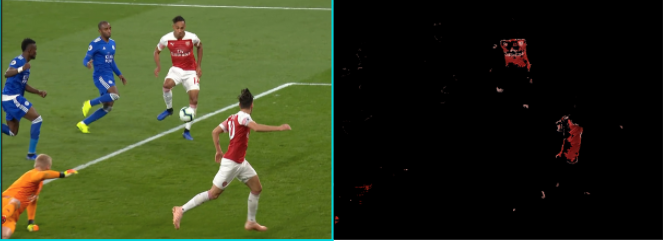

# Football Computer vision & Deep learning
Tracking players and ball on match footage using Tensorflow Object detection API and OpenCV. 
Using Computer Vison, the project detects the differents Teams playing and their pace.
We then recognize the ball and attempt to fit its trajectory.

This video inspired me: https://www.youtube.com/watch?v=GrAdG9r7shU&list=WL&index=42 

# Demo
See the example GIF below of Arsenal's wonderful team goal against Leicester.

We can identify all the players, the referee, the ball and also predict in which team the player is based on the color of their jersey.
(These teams have obviously a great jersey for recognition on a green pitch)

The soccer ball wasn't easily recognized because of its size.
We managed to find it with some OpenCV manipulations      (filter : Canny, BGR2GRAY, HSV Boundaries ; Circles :findContours , minEnclosingCircle )

<h3>Filtration example on Arsenal's Jersey :</h3>

<h3>Circles extracted after applying the filter:</h3>

<h5>The players' socks were also disturbing the recognition process as they are the same color as the ball</h6>

# Some information 
The API provides pre-trained object detection models that have been developed on the COCO dataset.
We have chosen the SSDLite mobilenet v2 due to the interest in real time analysis. 

We have used the pre-trained model and its weights but it would be more efficient with additional data for training the model on the differents players (although this would obviously take more time).

The boundarires.py file finds the HSV boundaries manually for Team detection.

The load_model_data.py file loads the pipeline configuration and builds a detection model, and then restores a checkpoint that allows the model to be changed easily.

<h2>Developpement tools</h2>
<ul>
<li>Tensorflow 2.0</li>

<li>Python 3.8.6</li>

<li>OpenCV 2.4</li>
</ul>

# Important links:

-For openCV circle detection : https://github.com/opencv/opencv/blob/3.4/samples/python/tutorial_code/ShapeDescriptors/bounding_rects_circles/generalContours_demo1.py

https://docs.opencv.org/3.4/da/d0c/tutorial_bounding_rects_circles.html

-For team detection :https://github.com/priya-dwivedi/Deep-Learning/blob/master/soccer_team_prediction/soccer_realtime.ipynb

-Tensorflow for macOS Big Sur : https://github.com/apple/tensorflow_macos

-Tensorflow object detection documentation : https://tensorflow-object-detection-api-tutorial.readthedocs.io/en/latest/

# Future Work

Implement Optical flow to more accuratly follow and track the ball

We can imagine getting the pace of the players and the ball. This could be simpler with a stable footage

We can create a mini-map based on the players' positions. 

An idea would be to help blind people to folow the game --> https://www.youtube.com/watch?v=0KE1lIeVBH8
